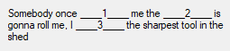

# guessW_RD

## Build and run instructions (CodeBlocks mingw)

1. Clone the repo
1. Open the `.cbp` file using CodeBlocks
1. Build the application
1. Run the application and watch the win32 app open

## Game instructions
The name of the game is pretty much self explanatory - you will be guessing words. These words are denoted in text by a number surrounded by underscores (the picture below contains three of them).
 
GOAL - guess as many of missing words as you can.

### Rules
- Words are guessed in the order that they are labelled
- Once you guess a word, you cannot go back and change your choice
- Only exact match with an answer is accepted as correct, so make sure not to add any whitespaces or other symbols
- No looking at the source XML files that contain the answers to puzzles :)

### Technical details
- Games are loaded from XML files that are found in `./games` folder
- There is no XSD schema to validate if a new game you want to add is valid. Regardless, it is not difficult to follow the logic (have a valid XML document, keep the same number of missing words and answers and the same structure of XML document as in the examples and you should be good to go)
-

## XMLLoader (DLL project)
Project can be found in `./XMLLoader/` of this repo. 
XMLLoader is a library that contains only a single publically available static method `LoadFromDir(path: string)` which given a path to a directory, will go through the files inside and will find and return the names of found XML files. 

XMLLoader DLL lib is included in this project and linked already. If there is a need to change something and include a new one, `./xmlLoaderLib/libXMLLoader.a` should be changed, as well as `./XMLLoader.dll` and `./xmlLoaderDll.h`.

### Build instructions
1. Open the `.cbp` file using CodeBlocks
1. Build the application
1. Find the `*.dll` and `*.a` files in `bin/Debug/` or `bin/Release/`
